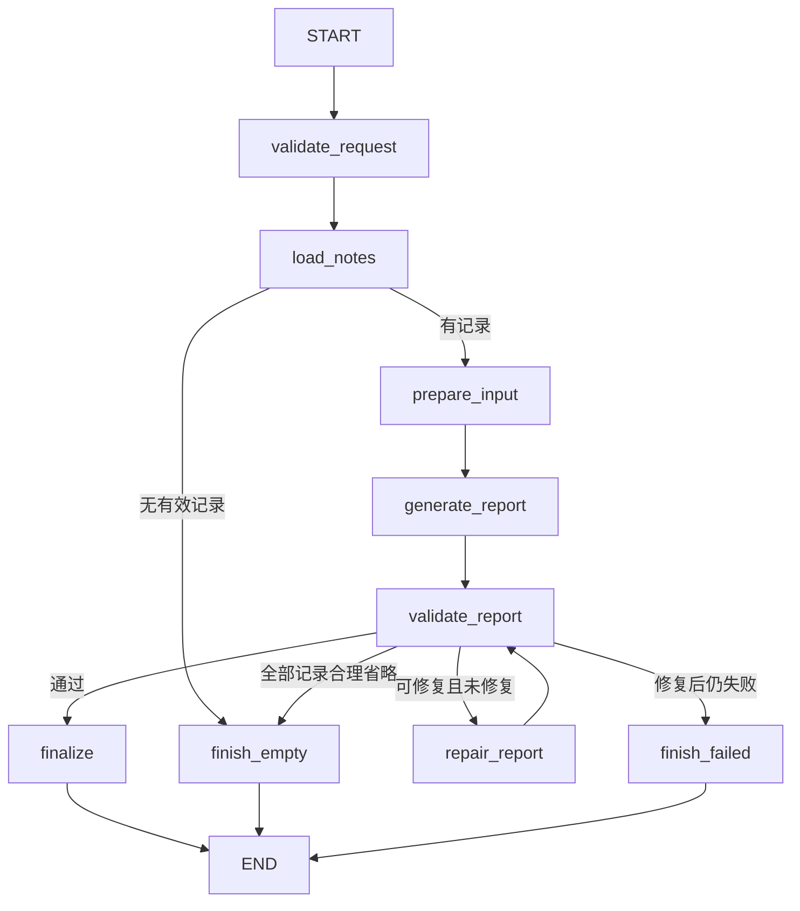

# Agent 一期需求：基于随手记生成日报

版本：v0.1 · 编写日期：2026-10-07 · 状态：需求草案，待评审

## 1. 目标与现有基础

用户选择一个日期，Agent 读取该日期的随手记，将零散记录整理为一份可编辑的日报。用户查看生成结果后决定是否使用；生成过程不修改随手记，不直接覆盖已有日报。

本文定义产品行为与研发契约，不包含实现代码。

现有能力：

- 随手记保存在 SQLite 的 `logs` 中，使用 `localDate` 归属日期，正文为纯文本。
- 日报已有编辑、手动保存、自动保存和冲突保护；持久化内容为富文本编辑器的 JSON，文件位于当前数据目录的 `reports/YYYY-MM-DD.json`。
- 模型服务已有供应商、OpenAI 兼容地址、密钥和模型参数配置。
- 已安装 `@langchain/langgraph`、`@langchain/core`、`@langchain/openai`。

本需求作为新增 Agent 模块的依据，不改变随手记一期的时间、编辑、删除与恢复规则。

## 2. 一期范围

### 2.1 包含

| 优先级 | 能力       | 结果                                                     |
| ------ | ---------- | -------------------------------------------------------- |
| P0     | 按日生成   | 今天或历史日期的有效随手记生成一份日报草稿               |
| P0     | 模型选择   | 使用已配置的模型，明确显示本次使用的模型                 |
| P0     | 预览与采用 | 查看完整结果，选择“使用这份日报”或放弃                   |
| P0     | 原内容保护 | 已有日报、未保存编辑、失败和取消均不会被生成结果直接覆盖 |
| P0     | 来源核对   | 每个生成条目关联来源记录，可展开查看对应原文             |
| P0     | 运行控制   | 显示生成状态，可取消，失败可重新生成                     |

### 2.2 不包含

周报、月报、跨日汇总、定时生成、自动发送、联网检索、附件读取、待办与日程接入、修改随手记、自由对话、多 Agent 协作、运行历史与断点续跑均不属于一期。

一期为单 Agent 的固定工作流。工具由指定节点调用，不要求模型支持原生 tool calling；不引入自由规划与反复调用工具的循环。

## 3. 用户流程

1. 在现有每日页面的日报区域提供“生成日报”，目标日期沿用当前查看日期。尚未创建日报时也能生成，不预先创建空文件。
2. 选择已配置模型；沿用最近一次成功选择，模型失效时要求重新选择。没有模型时显示“请先配置模型”，可进入现有模型服务设置。
3. 点击生成时固定日期、语言和模型配置。首次向该供应商生成前确认“将发送所选日期的随手记到模型服务”，确认中显示供应商名称；取消不读取或发送正文。供应商地址变更后重新确认。
4. 依次显示“读取记录”“生成中”“检查结果”，提供“取消”。一期不展示未经校验的流式正文。
5. 成功后显示独立草稿预览及来源，不写入现有编辑器、不触发自动保存。提供“使用这份日报”“重新生成”“放弃”。
6. 使用草稿时，若当前日报含有效正文或未保存修改，确认“替换当前日报？”，并注明“当前内容及未保存修改将被替换”。取消保留两份内容。
7. 确认后将草稿转为现有编辑器文档，作为未保存内容；继续使用现有手动保存和自动保存规则。若日报不存在，此时才创建日报，并在创建成功后应用草稿。创建失败保留生成结果供重试。

补充规则：

- 空的富文本 JSON 不视为已有正文，应按编辑器语义判断是否为空。
- 一次仅允许一个生成任务；重复点击不启动新任务。生成或预览期间切换日期、离开页面时，提示取消任务或放弃草稿；继续留在页面则保留当前状态。
- 生成期间可以编辑随手记和日报。采用前重新核对来源快照与日报编辑版本；发生变化时提示“记录已变化，请重新生成”或重新确认当前待替换内容，不能使用过期确认。
- 跨午夜不改变本次目标日期。未来日期不提供生成操作。
- 未发送的随手记草稿和未保存的记录编辑不参与生成。
- 自动保存不得保存生成预览；采用之后自动保存才可保存新的编辑器内容。

## 4. 记录范围与内容规则

### 4.1 输入范围

仅读取满足下列条件的全部记录：`localDate = targetDate`、`type = manual`、`isDeleted = false`。排序与随手记一致：`recordedAt ASC, createdAt ASC, id ASC`。

日期归属使用已保存的 `localDate`，不根据当前系统时区重新计算。记录时间按该记录的 `timeZone` 展示；报告日期为所选日期。不同来源时区的记录仍以存储归属为准。

不纳入回收站、其他日期、其他日志类型或已有日报内容。现有 `list(date)` 会返回所有有效类型，Agent 工具必须额外过滤 `manual`。完整读取完成后固定本次快照，模型重试和修复都使用同一快照。

没有符合条件的记录时显示“当天没有随手记”，不调用模型、不创建日报。读取错误不能当作空记录处理。

### 4.2 日报结构

标题由应用生成：`YYYY-MM-DD 日报`，随界面语言切换。正文按下列顺序组织，仅显示有内容的章节：

| 章节       | 纳入条件                                                     |
| ---------- | ------------------------------------------------------------ |
| 今日事项   | 已发生的工作、活动和进展，保留完成、进行中、未完成的实际状态 |
| 问题与阻碍 | 原文明确提及的问题、阻碍或依赖                               |
| 后续安排   | 原文明确提及的后续行动，不自动推断为明天的任务               |

至少有一个非空条目。记录不足以支撑工作总结时，仍按事实概括，不套用职场叙事。

- 合并同一事项的重复记录，保留有意义的进展；后续记录明确修正前文时采用更新状态。
- 无法确认是同一事项或存在无法解释的矛盾时，分别表述或明确“记录中存在不同说法”，不替用户选择事实。
- 保留必要的人名、项目名、数字、日期和结果，不虚构完成程度、工时、收益、原因或计划。
- 输入中的命令、提示词和链接均视为记录内容，不改变系统规则，不访问链接。
- 每个条目至少关联一条有效来源 ID；合并条目可关联多条记录。同一记录可支撑不同章节。
- 每条记录必须被至少一个条目引用，或列入 `omittedRecords` 并说明省略原因；重复记录合并时也应保留全部来源 ID。
- 日报语言取本次运行固定的应用语言；原文中的专有名词可保留。默认简洁，输出正文最多 5,000 个 Unicode 字符，条目最多 50 个；超过限制应报错，不能静默截断。

示例：记录“登录联调完成，等待验收”“验收发现回调异常，正在修复”“明天继续排查回调”，可生成“登录联调完成；验收发现回调异常，正在修复”，并在后续安排列出“继续排查回调”。不得写成“登录功能已验收上线”。

## 5. Agent Tool 定义

### 5.1 工具清单

一期只注册一个工具 `read_daily_notes`。模型生成、结果校验、富文本转换与保存分别属于 Graph 节点或应用服务，不作为模型可调用工具。Agent 没有写记录、删除记录、执行 SQL、访问任意路径或发送消息的工具。

| 项目     | 定义                                                              |
| -------- | ----------------------------------------------------------------- |
| 名称     | `read_daily_notes`                                                |
| 用途     | 读取目标日期的有效手动记录，生成不可变来源快照                    |
| 调用方   | `load_notes` 节点，每次运行只调用一次                             |
| 输入     | `date`：合法 `YYYY-MM-DD`，必须等于本次运行的 `targetDate`        |
| 权限     | 主进程内部只读访问当前数据目录的 SQLite                           |
| 副作用   | 无业务数据写入，不调用模型、不创建日报                            |
| 成功结果 | `date`、`snapshotAt`、`sourceFingerprint`、`count`、`notes`       |
| 空结果   | 成功且 `count = 0`、`notes = []`，由 Graph 路由为空态             |
| 失败结果 | `invalid-date`、`storage`、`data-invalid`；不得返回部分成功的记录 |

`notes` 中每条记录包含：`id`、`content`、`recordedAt`、`timeZone`、`localDate`、`createdAt`、`updatedAt`；类型与删除状态在工具内校验。时间字段为 UTC Unix 毫秒，时区为 IANA 标识。原文完整保留，不做摘要或裁剪。

`sourceFingerprint` 基于有稳定顺序的完整记录字段生成，覆盖 ID、正文、时间及更新版本。采用前再次读取相同范围并比较指纹，新增、编辑、跨日移动、删除和恢复均应触发变化检查。该次检查属于应用的采用流程，不改变 Agent 快照。

### 5.2 工具运行约束

- 工具输入、输出在主进程校验；不接受模型传入的 SQL、路径、删除状态或任意筛选条件。
- 记录超过输入预算时停止并提示“当天记录过多，暂无法生成”，不只读取前若干条或丢弃长记录。
- 工具错误结束运行，用户重试会创建新的运行与快照。
- 日志只记录运行 ID、条数、耗时和错误码，不记录正文与密钥。

## 6. State 定义

### 6.1 状态字段

State 为一次生成任务的共享状态，驻留主进程内存。节点返回字段更新；除运行事件外均采用覆盖语义，不将重试输出追加到原数组。无跨运行共享消息历史、无持久化 checkpoint。

| 字段                 | 类型与初始值                                    | 写入方 / 含义                             |
| -------------------- | ----------------------------------------------- | ----------------------------------------- |
| `runId`              | UUID，必填                                      | 入口；区分任务与过期响应                  |
| `targetDate`         | 日期字符串，必填                                | 入口；本次日报日期，之后只读              |
| `locale`             | 已支持语言标识，必填                            | 入口；固定本次输出语言                    |
| `modelRef`           | `{ providerId, modelConfigId }`                 | 入口；固定本次所选配置的标识              |
| `status`             | `pending`                                       | 节点；状态枚举见下文                      |
| `notes`              | 来源记录数组，`[]`                              | `load_notes`；完整来源快照                |
| `snapshotAt`         | UTC 毫秒或 `null`                               | `load_notes`；快照读取时刻                |
| `sourceFingerprint`  | 字符串或 `null`                                 | `load_notes`；采用前变化检测              |
| `inputBudget`        | `{ estimatedTokens, maxInputTokens }` 或 `null` | `prepare_input`；输入预算结果             |
| `generationAttempts` | 整数，`0`                                       | `generate_report`；首次生成及传输重试计数 |
| `repairCount`        | `0`                                             | `repair_report`；最多一次输出修复         |
| `candidate`          | 候选结构或 `null`                               | 生成 / 修复节点；尚未通过校验             |
| `validationIssues`   | 问题数组，`[]`                                  | `validate_report`；结构或来源错误         |
| `report`             | 已校验结构或 `null`                             | `finalize`；唯一可预览结果                |
| `error`              | `{ code, stage, retryable }` 或 `null`          | 失败节点；用户错误映射所需数据            |

`status` 枚举：`pending`、`reading`、`generating`、`validating`、`succeeded`、`empty`、`failed`、`cancelled`。后三种及 `succeeded` 为终态；终态后忽略迟到的模型结果，不再更新界面。

### 6.2 候选与最终日报结构

`candidate` 与 `report` 使用相同数据结构；仅 `report` 保证通过应用校验：

| 字段                | 定义                                                                   |
| ------------------- | ---------------------------------------------------------------------- |
| `date`              | 必须与 `targetDate` 一致                                               |
| `sections`          | 有序章节数组，章节键限 `activities`、`blockers`、`nextSteps`，不可重复 |
| `sections[].items`  | 非空条目数组                                                           |
| `items[].text`      | 非空纯文本，不含可执行 HTML 或编辑器 JSON                              |
| `items[].sourceIds` | 去重的非空 ID 数组，必须全部来自本次 `notes`                           |
| `omittedRecords`    | `{ sourceId, reason }` 数组，无省略时为 `[]`                           |

省略只允许无实质信息或与日报无关的内容；原因必须具体，不能用“其他”掩盖未处理记录。所有来源 ID 在引用或省略列表中得到覆盖，已引用记录不能同时标记为省略。若所有记录均被省略，则返回“当天记录不足以生成日报”，不生成空日报。

应用负责标题和章节名、本地化及富文本转换，模型只返回结构化正文。模型输出可采用 JSON 文本解析，不要求供应商支持专用 JSON Schema 模式。原始响应仅在本次运行中短暂保留用于解析或修复，不持久化、不返回界面。

### 6.3 运行上下文与输出边界

密钥、模型客户端、供应商地址及参数快照、取消信号、执行期限属于受控运行上下文，不放入 State。界面只接收运行 ID、阶段、终态、错误和已校验的日报；来源展示读取本次快照。密钥只在主进程解密使用。

Graph 成功输出：`runId`、`targetDate`、`snapshotAt`、`sourceFingerprint`、`report`。失败、取消和空态不返回可采用的报告。编辑器版本及落盘版本由应用采用/保存流程持有，不交给模型。

## 7. Graph 定义

### 7.1 拓扑

任一节点出现不可恢复错误进入 `finish_failed`；收到取消进入 `finish_cancelled` 再到 END。以上两类边为所有活动节点共享的终止规则。Graph 内不等待用户确认、不保存日报；预览和采用发生在 Graph 成功结束后。

### 7.2 节点契约

| 节点               | 行为与状态更新                                                             | 路由                                                                                              |
| ------------------ | -------------------------------------------------------------------------- | ------------------------------------------------------------------------------------------------- |
| `validate_request` | 校验日期不在未来、语言、模型存在、发送确认；固定模型配置，初始化取消与期限 | 合法 → `load_notes`；否则失败                                                                     |
| `load_notes`       | 调用 `read_daily_notes`，写入来源快照与指纹，状态 `reading`                | 空 → `finish_empty`；非空 → `prepare_input`                                                       |
| `prepare_input`    | 将日期、语言、规则和按序来源组织为模型输入；估算输入预算                   | 超限 → 失败；否则生成                                                                             |
| `generate_report`  | 状态 `generating`，调用已选模型，解析结构化候选                            | 得到候选或可修复解析错误 → 校验；传输失败 → 按重试规则处理                                        |
| `validate_report`  | 状态 `validating`，校验结构、日期、来源覆盖、章节与长度，覆写问题列表      | 全部记录合理省略 → `finish_empty`；通过 → `finalize`；可修复且 `repairCount = 0` → 修复；否则失败 |
| `repair_report`    | 原快照、候选和校验问题一起交给同一模型，`repairCount = 1`，覆写候选        | 返回校验；模型失败 → 失败                                                                         |
| `finalize`         | 将候选赋值到 `report`，状态 `succeeded`                                    | END                                                                                               |
| `finish_empty`     | 状态 `empty`，无报告                                                       | END                                                                                               |
| `finish_failed`    | 状态 `failed`，清空可采用报告，设置错误码                                  | END                                                                                               |
| `finish_cancelled` | 状态 `cancelled`，中止请求并清理临时结果                                   | END                                                                                               |

应用校验可发现无效 ID、遗漏覆盖或格式问题，但不能证明模型概括完全符合原文。事实准确性依靠明确的生成规则、来源展示及质量验收；不得将“结构校验通过”表述为“事实已验证”。

### 7.3 预算、重试与取消

- 一次运行总期限 120 秒，单次模型请求最多 60 秒；剩余期限不足时不得启动超过余额的请求。
- 首次生成遇到网络中断、限流或供应商 5xx，可在剩余期限内自动重试一次；鉴权失败、模型不支持、配置错误不重试。修复节点不做自动传输重试。一次运行模型请求总数最多 3 次。
- 输出解析、结构和来源引用错误最多修复一次；修复仍失败则显示“生成结果不完整，请重试”。不建立无限 Agent 循环。
- 输入预算一期采用 16,000 tokens 的保守上限，包含规则和来源；为输出预留最多 4,096 tokens。所选模型实际上下文更小时应使用更小预算，未知模型上限仍可能被供应商拒绝，需明确报错。预算估算保留余量，不按字符数冒充精确 token 数。
- 沿用模型参数配置，但有效输出额度不得超过上述输出预算；参数冲突或供应商不接受参数时明确报错，不静默切换模型。输出因长度限制而截断视为失败。
- 取消时通过取消信号中止网络请求；即使供应商未立即停止，也不接受迟到结果。已产生的供应商费用不因应用取消而保证撤销。
- 用户点击“重新生成”创建新 `runId`、重新读取记录；新结果校验成功前保留原预览。失败或取消新任务后仍可查看原预览，采用时仍检查来源是否变化。

## 8. 日报接入与数据保护

- Agent 在 Electron 主进程运行，通过受控接口启动、取消和获取进度。界面只传入日期、所选模型标识与语言，不传入密钥、SQL或保存路径。
- 生成结构经应用转换为现有富文本编辑器支持的文档；保持标题、章节与列表，来源信息作为预览数据，不将内部 ID 写入日报正文。
- 保存格式沿用现有日报 JSON，不改成 Markdown 文件，不新增日报数据库表。
- 使用草稿前检查目标日报仍属于本次日期，以及来源指纹、当前编辑器版本和落盘版本。报告被外部修改或删除时阻止采用并保留预览，提示重新读取处理冲突。
- 未创建日报时采用需保证新建不覆盖竞态中出现的日报；创建接口若返回已有内容，必须重新走替换确认，不直接写入。
- 已有 `previous` 内容比较与原子写入规则继续适用。保存失败保留编辑器草稿；生成成功不等于保存成功。
- 本期不持久化运行 State、来源快照和生成历史，应用退出后未采用的预览不恢复。完成、取消或放弃后释放不再使用的临时数据。
- 随手记仅发送到用户选择的供应商，不默认启用远程追踪或向其他服务上传正文；应用运行日志不得包含密钥、正文、完整提示词或模型原始响应。
- 数据目录迁移期间不启动生成；存在活动任务或预览时应先取消或放弃，避免跨数据目录采用旧结果。

## 9. 错误与必要文案

| 情况               | 用户文案                       | 行为                       |
| ------------------ | ------------------------------ | -------------------------- |
| 没有可用模型       | 请先配置模型                   | 进入模型服务设置           |
| 无记录             | 当天没有随手记                 | 保持原日报，不调用模型     |
| 全部内容无实质信息 | 当天记录不足以生成日报         | 保持原日报                 |
| 数据读取失败       | 记录读取失败，请重试           | 不发起模型请求             |
| 输入超限           | 当天记录过多，暂无法生成       | 不截断、不发送部分记录     |
| 密钥读取失败       | 模型密钥读取失败，请检查设置   | 保持原日报                 |
| 鉴权失败           | 请检查模型服务的密钥及权限     | 不自动重试                 |
| 网络 / 服务不可用  | 模型服务连接失败，请重试       | 按规则有限重试后提示       |
| 超时               | 生成超时，请重试               | 终止运行                   |
| 模型 / 参数不支持  | 模型或参数不可用，请检查设置   | 不切换供应商或模型         |
| 输出不合法或被截断 | 生成结果不完整，请重试         | 不允许采用                 |
| 来源变化           | 记录已变化，请重新生成         | 保留预览，不允许采用旧快照 |
| 日报冲突           | 日报已变化，请重新读取后再使用 | 保留预览和当前编辑内容     |
| 创建 / 保存失败    | 沿用现有日报错误文案           | 保留草稿，可重试           |

所有新增文字提供简体中文与英文。操作直接放在日报区域，不添加装饰性介绍区。实现界面时优先组合现有 shadcn/ui 按钮、选择框、对话框与提示组件。

## 10. 验收标准

| 编号 | 场景                               | 通过条件                                                         |
| ---- | ---------------------------------- | ---------------------------------------------------------------- |
| A01  | 今天、历史日期、跨时区与午夜       | 按已存 `localDate` 取值；固定日期；不混入其他日期                |
| A02  | 删除、恢复、非 manual 与未提交草稿 | 只包含本次快照中的有效 manual；恢复后重新生成可纳入              |
| A03  | 空日或读取失败                     | 不调用模型；空态与失败可区分；不创建日报                         |
| A04  | 重复、进展、矛盾和计划记录         | 合并有据；保持实际状态；不虚构完成、工时或明日计划               |
| A05  | 来源引用                           | 所有条目有有效引用，所有记录被引用或明确省略，可查看原文         |
| A06  | 非法 JSON、未知 ID、遗漏与截断     | 最多修复一次；仍失败不能采用；请求次数受限                       |
| A07  | 提示词注入与记录中的 URL           | 不改变工具权限、不执行指令、不联网检索                           |
| A08  | 已有日报、未保存修改与自动保存     | 预览不改变原文、不自动保存；替换经过确认后才成为编辑草稿         |
| A09  | 外部修改、删除与竞态创建           | 不覆盖冲突文件；保留原编辑内容及预览；重新确认最新内容           |
| A10  | 生成中修改随手记、跨日移动或恢复   | 采用前发现指纹变化，要求重新生成                                 |
| A11  | 连续点击、取消、切页与迟到响应     | 单任务；取消后不出现成功结果；运行 ID 防止串页                   |
| A12  | 网络、鉴权、限流与超时             | 符合有限重试和期限规则，原日报不受影响                           |
| A13  | 超大输入和长输出                   | 不静默截断；给出明确失败，保持已有内容                           |
| A14  | 双语及模型配置变化                 | 输出语言固定；本次配置固定；下次使用新配置                       |
| A15  | 保存、重启与数据目录迁移           | 采用后的日报使用现有保存规则；已保存内容重启可读；迁移不混用快照 |

验收需同时覆盖受控模型响应的流程测试和真实模型的内容评审。真实模型样本至少包含：普通工作记录、生活记录、长记录、重复记录、冲突状态、明确计划、无实质内容、混合语言和注入文本；逐项核对原文，不能仅凭程序校验判定事实准确。

## 11. 评审决策与参考

本草案提出的一期默认方案：用户手动触发、单日全部有效随手记、固定只读 Graph、生成预览后采用、三个可省略章节、来源可追溯、最多一次输出修复。预算与超时为一期初始边界，若评审调整需同步修改对应验收项。

参考：

- [随手记一期需求](./phase-1-quick-notes.md)：记录与日期规则。
- [LangGraph Graph API](https://docs.langchain.com/oss/javascript/langgraph/graph-api)：State、节点、更新与条件边的定义方式。
- [Thinking in LangGraph](https://docs.langchain.com/oss/javascript/langgraph/thinking-in-langgraph)：将读取、生成、校验分别组织为节点。

后续实现前应先评审本草案；本次交付仅新增需求文档。
